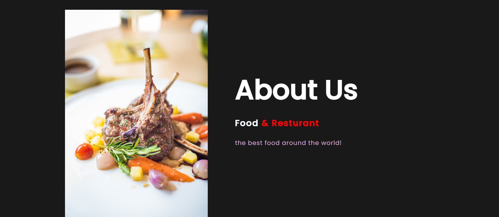
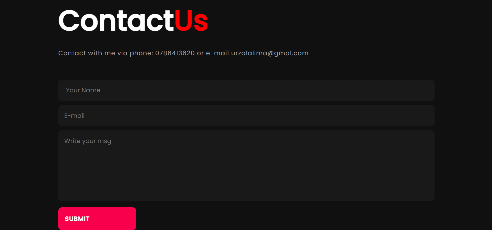

## Afghani Food
Afghani food is a site that hopes to help people to find more information about Afghani Food. The site will be targeted toward all people who are around the world and looking for a way to socialise and enjoiy from their letuier times with their friends, families and colleques. Afgani Food will be a useful way to people to preview the Afghani Food  advance.

### Features
#### Existing Features
##### Navigation Bar
Featured on all three pages, the full responsive navigation bar includes links to the Home page, about page and Contact page and is identical in each section to allow for easy navigation.
This section will allow the user to easily navigate from page to page across all devices without having to revert back to the previous page via the ‘back’ button.

### The landing page image
The landing includes a photograph with text overlay to Welocome users on the page.
This section introduces the Afghni Food to people and grab their attention for  food .

### About Ms.Cook
The About section gives the people More information about Afghani Food, location.
This section will help the Users to gain information about Food.

### Contact page
Form
the form section contents input element for name, input element for email, and text erea for leaving a message and submit button.
This form allows users to share their questions, comments, feedbacks and any concern they may have with restuarant personels.

### The Footer
The footer section includes links to the relevant social media sites for Afghani Food. The links will open to a new tab to allow easy navigation for the user.
The footer is valuable to the user as it encourages them to keep connected via social media.

### Features Left to Implement
I'd Like to develope this project , the feature I'll implement :\

more user-frindly 
Responsive

### Bugs
 #### Solved Bugs
  
  When I started project, Gitpod had problem. the sever does not work. I had to write python3 -m http.sever after every line cod .until I understood that I had to open 2 terminals.
  

## Deployment
The site was deployed to GitHub pages. The steps to deploy are as follows:

In the GitHub repository, navigate to the Settings tab.
From the source section drop-down menu, select the Main Branch.
Once the Main branch has been selected, the page will be automatically refreshed with a detailed ribbon display to indicate the successful deployment.
The live link can be found here - (Afghani-food1)[ https://limazurmati.github.io/Afghani-food1/]

## Credit
The credits section breack up into : Content and Media .

## Content

The font for the  body google font
The icons in the footer were taken from Font Awesome

### Media
The photos used on the home (Hero Image) and about page are from Pexiel site